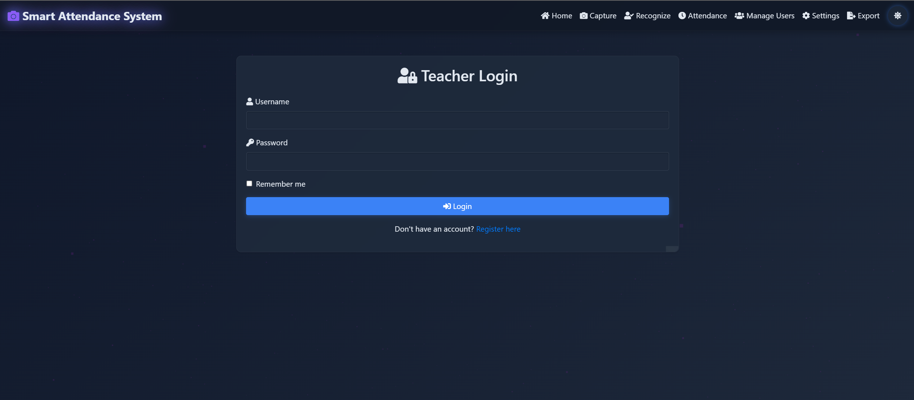

# Smart Attendance System Based on Face Recognition

A Python-based attendance system that uses face recognition to automatically mark attendance in real-time. This system is designed to be efficient, accurate, and easy to use for educational institutions, workplaces, and events.

## Features

- Real-time face detection and recognition
- Automatic attendance marking
- User-friendly web interface
- Export attendance records
- Multi-user support
- High accuracy with deep learning models

## Prerequisites

- Python 3.7 or higher
- OpenCV
- face_recognition library
- Flask
- NumPy
- Other dependencies listed in requirements.txt

## Installation

1. Clone the repository:
   ```bash
   git clone https://github.com/kunalhacks/Smart-Attendance-System--Based-on-Face-Recognition.git
   cd Smart-Attendance-System--Based-on-Face-Recognition
   ```

2. Install the required packages:
   ```bash
   pip install -r requirements.txt
   ```

## Usage

1. Run the application:
   ```bash
   python app.py
   ```

2. Open your web browser and navigate to `http://localhost:5000`

3. Follow the on-screen instructions to:
   - Register new users
   - Mark attendance
   - View attendance records

## Project Structure

```
Smart-Attendance-System/
├── static/
│   ├── css/           # CSS files
│   ├── js/            # JavaScript files
│   └── images/        # Sample images and icons
├── templates/         # HTML templates
├── dataset/           # Training images
├── app.py             # Main application file
├── requirements.txt   # Project dependencies
└── README.md          # This file
```

## Screenshots

<div align="center">
  <h3>Application Screenshots</h3>
  
  <div style="display: grid; grid-template-columns: repeat(2, 1fr); gap: 20px; margin-top: 20px;">
    <!-- Row 1 -->
    <div style="text-align: center;">
      
      <p><strong>Dashboard</strong><br>Main interface showing overview</p>
    </div>
    
    <div style="text-align: center;">
      
      <p><strong>Login Page</strong><br>Secure access to the system</p>
    </div>
    
    <!-- Row 2 -->
    <div style="text-align: center;">
      
      <p><strong>Attendance Records</strong><br>View, manage & export attendance data</p>
    </div>
    
    <div style="text-align: center;">
      
      <p><strong>Teacher_dashboard</strong><br>Teacher's Dashboard</p>
    </div>
  </div>
</div>

## Contributing

Contributions are welcome! Please feel free to submit a Pull Request.

## Acknowledgments

- Built with Python and OpenCV
- Uses the face_recognition library
- Inspired by modern attendance systems

## Contact

For any queries or support, please contact [Kunal Sengar] at [kunalsengar1974@gmail.com]
